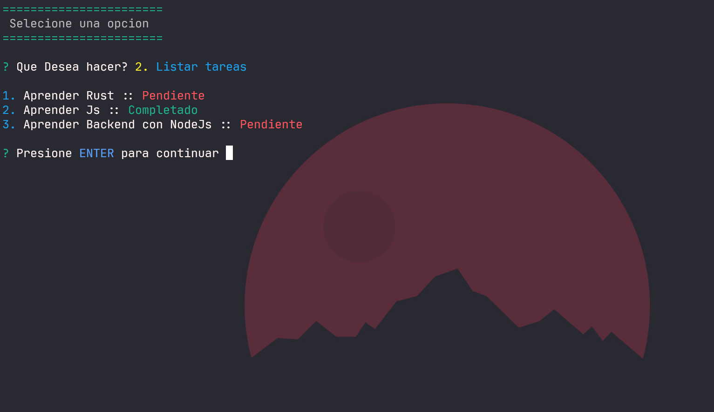

# Tareas App Nodejs

## Preview




## Setup 

*  Instalar las dependencias

```
npm install
```

* Correr la aplicación 

```
node app.js 
```

* También puedes correr el script go para correr la app :exclamation:

```
npm run go
```

> El wallpaper se encuentra en la carpeta assets :star2:
